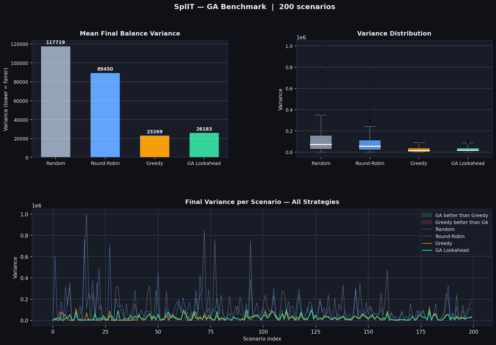

# SplIT — AI-Powered Group Expense Splitting

> **Course:** Biologically Inspired Artificial Intelligence
> **Authors:** Bartłomiej Barański, Maksymilian Pierchała, Jakub Tomaszewski

## Overview

SplIT solves the chaos of group travel expenses. Instead of settling debts _after_ a trip, SplIT uses a **Genetic Algorithm with lookahead** to proactively suggest _who should pay now_, keeping group balances near zero throughout the entire trip.

The core insight: if the right person pays every time, no settlement is needed at the end.

## How It Works

When a user adds an expense, the GA simulates the current payment **plus 5 future steps**, sampling probable future expenses using archetype behaviour models. It picks the payer whose choice creates the best long-term balance trajectory — not just the locally optimal one.

```
User adds expense: 200 USD, Hotel
        ↓
GA simulates 6 steps (current + 5 future)
        ↓
"Alice [Sponsor] should pay"
  → because Bob is a Saver and won't pay in future steps
        ↓
Balances updated for all members
```

## Benchmark Results

Evaluated on 200 randomly sampled scenarios from the synthetic dataset:

| Strategy         | Mean Variance | vs Random  |
| ---------------- | ------------- | ---------- |
| Random           | 117,719       | baseline   |
| Round-Robin      | 89,449        | -24.0%     |
| **GA Lookahead** | **26,183**    | **-77.8%** |
| Greedy           | 23,269        | -80.2%     |

GA beats Random in **85%** of scenarios and Round-Robin in **73.5%** of scenarios.



## Architecture

```
split/
├── data-generator/    # Faker-based synthetic dataset (10,000 scenarios)
├── ga-engine/         # PyGAD Lookahead GA + Flask microservice (port 5000)
├── backend/           # Spring Boot 3 REST API (port 8080)
├── frontend/          # React 18 web app (port 3000)
├── data/generated/    # Generated CSVs — gitignored, run generate.py to reproduce
└── docs/              # Technical documentation + benchmark results
```

## User Archetypes

| Archetype    | Behaviour                             | Acceptance Rate |
| ------------ | ------------------------------------- | --------------- |
| **Sponsor**  | Pays for flights, hotels, car rentals | 80%             |
| **Retailer** | Pays for coffee, taxis, restaurants   | 55%             |
| **Saver**    | Avoids payment prompts                | 20%             |

Archetypes drive realistic future simulation inside the GA — the algorithm knows a Saver won't pay for a hotel later, and plans accordingly.

## Quick Start

### 1. Generate synthetic data

```bash
cd data-generator
python3 -m venv .venv && source .venv/bin/activate
pip install -r requirements.txt
python generate.py
```

### 2. Start the GA microservice

```bash
cd ga-engine
source .venv/bin/activate
pip install -r requirements.txt
python api.py
# Listening on http://localhost:5000
```

### 3. Start the backend

```bash
cd backend
mvn spring-boot:run
# API at http://localhost:8080
# H2 console at http://localhost:8080/h2-console
```

### 4. Start the frontend

```bash
cd frontend
npm install && npm start
# Opens http://localhost:3000
```

### 5. Run the GA benchmark

```bash
cd ga-engine
source .venv/bin/activate
python benchmark.py
# Results saved to benchmark_results.png
```

### 6. Run the interactive terminal demo

```bash
cd ga-engine
source .venv/bin/activate
python main.py
```

## API Reference

| Method | Endpoint                                     | Description                         |
| ------ | -------------------------------------------- | ----------------------------------- |
| POST   | `/api/groups`                                | Create a trip group with members    |
| GET    | `/api/groups/{id}`                           | Get group state with live balances  |
| GET    | `/api/groups/{id}/suggest?amount=&category=` | Get GA suggestion (read-only)       |
| POST   | `/api/groups/{id}/expenses`                  | Add expense — GA auto-selects payer |
| GET    | `/api/groups/{id}/expenses`                  | List expense history                |

## Tech Stack

| Layer     | Technology                     |
| --------- | ------------------------------ |
| GA Engine | Python 3, PyGAD, Flask         |
| Backend   | Java 17, Spring Boot 3, H2     |
| Frontend  | React 18                       |
| Data      | Python 3, Faker, Pandas, NumPy |
